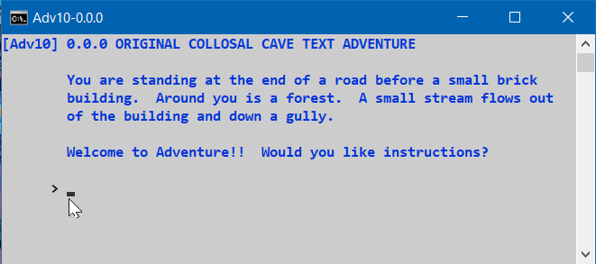

<!-- index.md 0.0.1                UTF-8                         2024-10-04
     ----1----|----2----|----3----|----4----|----5----|----6----|----7----|--*
     source <https://github.com/orcmid/Adv10/blob/master/docs/index.md>
     construction structure, manifest, and job jar at
     <https://orcmid.github.io/Adv10/>
     -->

# Adv10: Reviving the Original Collosal Cave Text Adventure

<table border="0" width="100%">
  <tr>
    <td width="72%" align="left">
       
    </td>
    <td width="28%" valign="middle" align="right">
      <b><code><a href="../" target="top">orcmid.github.io</a>&gt; 
	  <a href="./" target="_top">Adv10</a>&gt;
      </code></b>
        
      
        
      <b><code>
         <a href="index.html" target="_top">index.html</a>&gt;</code></b>
       
      <small><small>
        0.0.1 2024-10-05T23:03Z<!-- MAINTAIN THIS MANUALLY -->
      </small></small>
      </td>
  </tr>
</table>

> The ur-game for computers--Adventure--was originally written by Will
Crowther in 1975 or 1976 and significantly extended by Don Woods in 1977.
I have taken Wood's original FORTRAN program for Adventure Version 1.0 and
recast it in th CWEB idiom so that those pioneering ideas will be accessible
to a broader audience.
>> Donald E. Knuth [Knuth2011: p.235]

## Open-Source Adaptation

Copyright © 1998 by Don Woods and Don Knuth; all rights reserved.
Adapted with permission.

 Adv10 is derived from the 2010-01-26 version of Don Knuth's Literate
 Programming source code file, `advent.w.gz`, available at
 \[[Knuth's "advent"](http://www-cs-faculty.stanford.edu/~knuth/programs.html#advent)\].

This version incorporates all applicable errate published through November
2013 in Knuth's "Selected Papers on Fun and Games
\[[fg](http://www-cs-faculty.stanford.edu/~knuth/fg.html)\].

## The Orcmid on GitHub Project

Adv10 releases are a personal homage to this amazing and inspiring game.

The Adv10 project produces a Clean C version of the
original Colossal Cave Text Adventure as a portable command-line
implementation built on Microsoft Windows.  The game is playable.  The
open-source implementation of the game is meant to be instructive.

Adv10 is the first-stage project for progressive development of enriched
versions, from the command-line to 3D animated versions.  The first stage
is creating an anatomy and reverse-engineering of the game presented in
\[[Knuth2011: Chapter 27](../bib/authors.htm#Knuth2011)\]
as a Literate Program \[[Knuth1992](../bib/authors.htm#Knuth1992)\].

## Adv10 Table of Content

The nfoTools web is organized in topical sections.

| **Section** |  **General Topic** |
|   --:       |  ---               |
| dev | TBD |

## Security Concerns

The Adv10 Security Policy is provided at the
[Orcmid Adv10 Security](https://github.com/orcmid/Adv10/security) tab.
Consult that Security Policy statement to learn about any vulnerability
announcements and actions to be taken.  To report a suspected/detected
cybersecurity vulnerability in an Adv10 release, follow instructions
provided in the policy.

----

I invite discussion about Adv10 topics in the
[Discussion section](https://github.com/orcmid/Adv10/discussions).
Improvements and removal of defects in this particular documentation can be
reported and addressed in the
[Issues section](https://github.com/orcmid/Adv10/issues).  There are also
relevant [projects](https://github.com/orcmid/Adv10/projects?type=classic)
from time to time.

<table border="0" cellspacing="3" width="100%">
  <tr>
    <td width="14%">
	
    </td>
    <td width="54%" valign="middle" align="center">
      You are navigating the <a href="./">Adv10 Project on Github</a></td>
    <td width="30%">
      
created 2024-10-05 by
         <a target="_top" href="../orcmid">orcmid</a> 

    </td>
  </tr>
</table>
<!--
      0.0.1  2024-10-05T23:03Z Corrected links and image
      0.0.0  2024-10-05T21:51Z Initial placeholder, adapted from nfoTools
             hybridForm 0.0.13.

      -->
